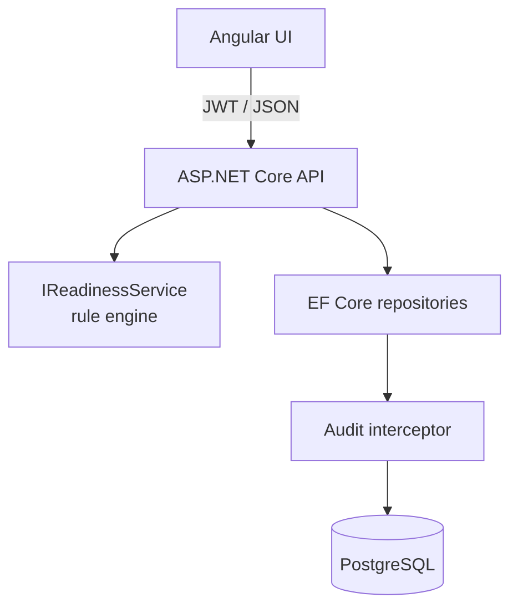

# TimeReady

Enterprise HR vacation readiness platform for evaluating employee leave preparation with explicit business rules, role-based access, and production-quality engineering practices.

[](https://dotnet.microsoft.com/)
[](https://angular.dev/)
[](https://www.postgresql.org/)
[](https://www.docker.com/)
[](https://github.com/mahbejam/TimeReady/actions/workflows/ci.yml)
[](LICENSE)

---

## 📋 Overview

**TimeReady** is an enterprise HR vacation readiness platform that helps HR teams determine whether an employee is prepared to take leave — before problems surface on the first day of absence.

The application stores the facts that matter for vacation preparation (time balance, remaining days, manager notification, handover status), evaluates them through a **rule-based decision engine**, and surfaces actionable findings. It is built as a **portfolio project** to demonstrate production-quality architecture, clean code, automated testing, and CI/CD — the kind of engineering practices expected in regulated, enterprise software environments.

| | |
| --- | --- |
| **Problem** | Vacation readiness checks scattered across spreadsheets, email, and tribal knowledge |
| **Solution** | Centralized employee data, explicit readiness rules, and role-aware access |
| **Audience** | HR operators and administrators — not a self-service employee portal |
| **Repository** | [github.com/mahbejam/TimeReady](https://github.com/mahbejam/TimeReady) |

### Live portfolio demo

Try the interactive [TimeReady portfolio demo](https://mahbejam.github.io/TimeReady/). It is a static GitHub Pages experience with simulated sample data, working time tracking, filters, and browser-local persistence — it is not connected to a live backend.

This repository still contains the real full-stack application: the ASP.NET Core API, Angular frontend, PostgreSQL integration, automated tests, and Docker Compose setup. The GitHub Pages site is an isolated demonstration of the product experience in `docs/index.html` and does not replace or modify those application layers.

---

## ✨ Features

### Core business capabilities

- **Employee management** — Create, read, update, and delete employee records with the fields required for readiness evaluation
- **Rule-based readiness engine** — Evaluates time balance, vacation timing, manager notification, and handover status through explicit, configurable thresholds
- **Readiness findings** — Returns blocking, warning, and informational findings with stable rule codes for explainability
- **Dashboard and notifications** — Angular UI surfaces readiness status and follow-up items at a glance

### Security and access control

- **JWT authentication** — Access tokens with configurable lifetime and refresh-token rotation
- **Role-based authorization** — Admin and Operator roles with policy-based endpoint protection
- **Authenticated-by-default API** — Endpoints require authentication unless explicitly marked anonymous
- **Account lockout** — Brute-force protection via ASP.NET Core Identity lockout settings
- **Security headers middleware** — Hardened HTTP response headers on every request
- **Rate limiting** — Fixed-window rate limiting per client IP address

### Data and compliance

- **Append-only audit trail** — Every data change captured through an EF Core save-changes interceptor
- **Audit search and filtering** — Admin-only query endpoints with validation
- **Audit retention and archiving** — Configurable retention policy with background processing, archive storage, and health monitoring

### Platform and operations

- **REST API** — ASP.NET Core 9 with API versioning, OpenAPI/Swagger (Development), and Problem Details error responses
- **Structured logging** — Serilog with console and rolling file sinks
- **Health checks** — Liveness, readiness, and background-service probes for orchestrators
- **Docker Compose stack** — One-command deployment of PostgreSQL, API, and web frontend
- **Database migrations and seed data** — EF Core migrations applied on startup with demo employees and accounts
- **Automated test suites** — 78 backend tests (unit + integration) and 38 frontend tests, validated on every push via GitHub Actions

---

## 🏗 Architecture

TimeReady follows a layered architecture with clear separation between presentation, application logic, domain rules, and infrastructure concerns.

```
Presentation
     ↓
Application
     ↓
Domain
     ↓
Infrastructure
```

| Layer | Responsibility | Implementation |
| --- | --- | --- |
| **Presentation** | HTTP endpoints, request validation, auth policies | ASP.NET Core controllers, FluentValidation, Angular standalone components |
| **Application** | Use-case orchestration, DTO mapping, auth services | Services, repositories, mapping extensions |
| **Domain** | Business rules, readiness evaluation, audit models | `IReadinessService`, rule engine, domain entities |
| **Infrastructure** | Persistence, identity, logging, background jobs | EF Core + PostgreSQL, Identity, Serilog, hosted services |

### Engineering principles

- **Separation of concerns** — The readiness rule engine has no dependency on HTTP or the database; it accepts domain input and returns a result
- **SOLID** — Interfaces for services and repositories; configuration bound through strongly typed options with startup validation
- **Dependency injection** — Constructor injection throughout; `TimeProvider` injected for testable date logic
- **Testability** — Unit tests for rules and services; integration tests boot the real API against throwaway PostgreSQL databases via `WebApplicationFactory`
- **Maintainability** — Extension methods group service registration; controllers stay thin; validation lives in dedicated FluentValidation classes
- **Scalability** — Stateless API design, connection pooling, rate limiting, and health probes suitable for container orchestration



Further detail: [docs/architecture.md](docs/architecture.md) · [docs/decisions.md](docs/decisions.md)

---

## 🛠 Technology Stack

### Backend

| Technology | Purpose |
| --- | --- |
| ASP.NET Core 9 | REST API host |
| ASP.NET Core Identity | User and role management |
| JWT Bearer authentication | Stateless access tokens |
| Entity Framework Core 9 | ORM and migrations |
| FluentValidation | Request validation |
| Serilog | Structured logging |
| Swashbuckle | OpenAPI / Swagger documentation |
| Asp.Versioning | Header, query, and media-type API versioning |

### Frontend

| Technology | Purpose |
| --- | --- |
| Angular 20 | Standalone components, routing, forms |
| Angular Material | Enterprise UI components |
| RxJS | Reactive state and HTTP |
| Vitest | Unit testing |

### Database

| Technology | Purpose |
| --- | --- |
| PostgreSQL 17 | Primary data store |
| Npgsql | .NET database provider |
| EF Core migrations | Schema versioning |

### Testing

| Technology | Purpose |
| --- | --- |
| xUnit | Backend test framework |
| WebApplicationFactory | Integration tests against real API host |
| Vitest + jsdom | Frontend unit tests |

### DevOps

| Technology | Purpose |
| --- | --- |
| GitHub Actions | Continuous integration on push and pull request |
| Docker Compose | Local and production-shaped container stacks |
| Docker multi-stage builds | API and frontend container images |

---

## 📁 Project Structure

```
TimeReady/
├── .github/
│   └── workflows/
│       └── ci.yml                    # GitHub Actions CI pipeline
├── backend/
│   ├── TimeReady.Api/
│   │   ├── Authorization/            # Roles and policy constants
│   │   ├── Configuration/            # Strongly typed options classes
│   │   ├── Controllers/              # REST API endpoints
│   │   ├── Data/
│   │   │   ├── Auditing/             # Save-changes audit interceptor
│   │   │   ├── Configurations/       # EF Core entity configurations
│   │   │   ├── Repositories/         # Data access abstractions
│   │   │   └── Seeding/              # Identity and demo data seeders
│   │   ├── Dtos/                     # Request and response models
│   │   ├── Extensions/               # Service registration and middleware
│   │   ├── Infrastructure/           # Background services, health checks
│   │   ├── Migrations/               # EF Core database migrations
│   │   ├── Models/                   # Domain and identity entities
│   │   ├── Services/                 # Application and domain services
│   │   └── Validation/               # FluentValidation rules and filter
│   └── TimeReady.Tests/
│       ├── Integration/              # API integration tests
│       └── Unit/                     # Service and rule unit tests
├── frontend/
│   └── src/
│       └── app/
│           ├── core/                 # Auth, services, state, models
│           ├── features/             # Dashboard, employees, audit, auth
│           └── shared/               # Reusable UI components
├── docs/                             # Product, architecture, security, API
├── docker-compose.yml                # Production-shaped stack
├── docker-compose.override.yml       # Local development conveniences
├── CONTRIBUTING.md
├── SECURITY.md
└── README.md
```

---

## 🔐 Authentication

TimeReady uses **JWT bearer authentication** with **role-based authorization**.

### Authentication flow

1. Client submits credentials to `POST /api/auth/login`
2. Server validates credentials via ASP.NET Core Identity and returns an access token and refresh token
3. Client sends the access token in the `Authorization: Bearer` header on subsequent requests
4. Refresh tokens rotate on `POST /api/auth/refresh`; logout revokes the refresh token

### Roles and policies

| Role | Capabilities |
| --- | --- |
| **Admin** | Full access — create/delete employees, read audit trail, manage retention |
| **Operator** | Day-to-day HR work — read employees, update preparation flags, view readiness |

Authorization is enforced through named policies (`employees:read`, `employees:update`, `employees:manage`, `audit:read`) rather than hard-coded role checks in controllers. The API defaults to requiring an authenticated user on every endpoint unless explicitly marked `[AllowAnonymous]`.

The Angular frontend mirrors these roles with route guards and conditional UI visibility.

Further detail: [docs/security.md](docs/security.md)

---

## 🧪 Testing

TimeReady maintains automated test coverage across both backend and frontend, validated on every push to `main`.

### Unit tests

Isolated tests for business logic without external dependencies:

- Readiness rule engine (`IReadinessService`)
- Token and refresh-token services
- Audit save-changes interceptor
- Audit retention service and monitor

### Integration tests

Full-stack tests that boot the real ASP.NET Core application via `WebApplicationFactory` against throwaway PostgreSQL databases:

- Authentication (login, refresh, logout, `/me`)
- Employee CRUD with role enforcement
- Readiness evaluation endpoints
- Audit search and retention endpoints

### GitHub Actions CI validation

Every push and pull request triggers the CI workflow, which:

- Builds and runs **78 backend tests** against a PostgreSQL service container
- Runs **38 frontend unit tests** and verifies the production build succeeds
- Uploads test result artifacts for inspection

| Suite | Tests | Scope |
| --- | --- | --- |
| Backend unit | 39 | Rules, services, interceptors |
| Backend integration | 39 | Real API + PostgreSQL |
| Frontend unit | 38 | Auth, guards, interceptors, state |

Further detail: [docs/testing.md](docs/testing.md)

---

## 🚀 CI/CD

The GitHub Actions workflow (`.github/workflows/ci.yml`) runs on every push and pull request to `main`.

### Backend job

1. Start PostgreSQL 17 as a service container
2. Restore and build the .NET solution (Release configuration)
3. Run all backend tests with integration-test environment variables
4. Upload TRX test result artifacts

### Frontend job

1. Install dependencies with `npm ci`
2. Run Vitest unit tests
3. Verify the production Angular build completes successfully

Both jobs run in parallel. A green CI run confirms the full stack builds, all 116 automated tests pass, and the frontend compiles for production deployment.

[](https://github.com/mahbejam/TimeReady/actions/workflows/ci.yml)

---

## 💻 Local Development

### Prerequisites

- [Docker Desktop](https://www.docker.com/products/docker-desktop/) (recommended), or
- .NET SDK 9.0, Node.js 20+, and PostgreSQL 17

### Full stack with Docker Compose

```bash
git clone https://github.com/mahbejam/TimeReady.git
cd TimeReady
docker compose up --build
```

| Service | URL |
| --- | --- |
| Application | http://localhost:4200 |
| API | http://localhost:5080 |
| Swagger UI | http://localhost:5080/swagger |
| API health | http://localhost:5080/health |

### Running without Docker

```bash
docker compose up -d db          # or use your own PostgreSQL instance

cd backend/TimeReady.Api && dotnet run     # http://localhost:5080
cd frontend && npm ci && npm start         # http://localhost:4200
```

### Running tests

```bash
docker compose up -d db
cd backend && dotnet test
cd ../frontend && npm test
```

### Demo accounts

| Account | Role | Password |
| --- | --- | --- |
| `admin@timeready.local` | Admin | `Admin#Demo2026` |
| `operator@timeready.local` | Operator | `Operator#Demo2026` |

> Demo credentials only. Change all passwords before any shared or internet-facing deployment.

Further detail: [CONTRIBUTING.md](CONTRIBUTING.md)

---

## 🎯 Design Philosophy

TimeReady is intentionally scoped as an **enterprise software engineering demonstration**, not a feature-maximal product.

The goal is to show how a real-world HR tool can be built with the discipline expected in regulated industries — pharmaceutical, industrial automation, financial services, and large-scale SaaS — where **correctness, traceability, and maintainability** matter more than surface-level complexity.

This project prioritizes:

- **Clean architecture** — Business rules isolated from infrastructure; dependencies point inward
- **Maintainability** — Readable code, grouped registrations, XML documentation, and structured docs
- **Production-ready practices** — Health probes, structured logging, rate limiting, security headers, configuration validation at startup
- **Software craftsmanship** — Explicit rule codes instead of opaque scoring; policy-based authorization instead of scattered role checks; reproducible date logic via injected `TimeProvider`
- **Scalability** — Stateless API, container-ready deployment, and separation that allows independent scaling of UI, API, and database tiers

Features that would add complexity without demonstrating engineering judgment — payroll integration, calendar sync, multi-tenancy, machine learning — are deliberately out of scope.

---

## 💡 Why This Project Exists

TimeReady exists as a **public portfolio project** by [mahbejam](https://github.com/mahbejam) to demonstrate end-to-end full-stack delivery for enterprise hiring teams.

It answers the questions reviewers typically ask:

1. Can this engineer **design a coherent architecture** with clear boundaries?
2. Do they write **testable, maintainable code** with appropriate abstractions?
3. Do they understand **security fundamentals** — authentication, authorization, audit trails?
4. Can they deliver a **working product** with CI/CD, Docker, documentation, and honest scope?

The repository is structured so a reviewer can clone, run, sign in, and evaluate the engineering quality within minutes — without reverse-engineering the codebase.

---

## 🔮 Future Improvements

Realistic enhancements that build on the current architecture without changing its core design:

- HttpOnly cookie storage for refresh tokens instead of client-side session storage
- Retention status screen in the Angular UI
- Natural-language summary of readiness findings (rules remain the source of truth)
- Per-manager filtered views within the existing single-tenant model
- OpenTelemetry distributed tracing for production observability
- GitHub Actions deployment workflow for container registry publish

---

## 📄 License

MIT — see [LICENSE](LICENSE).

Copyright (c) 2026 [mahbejam](https://github.com/mahbejam).
