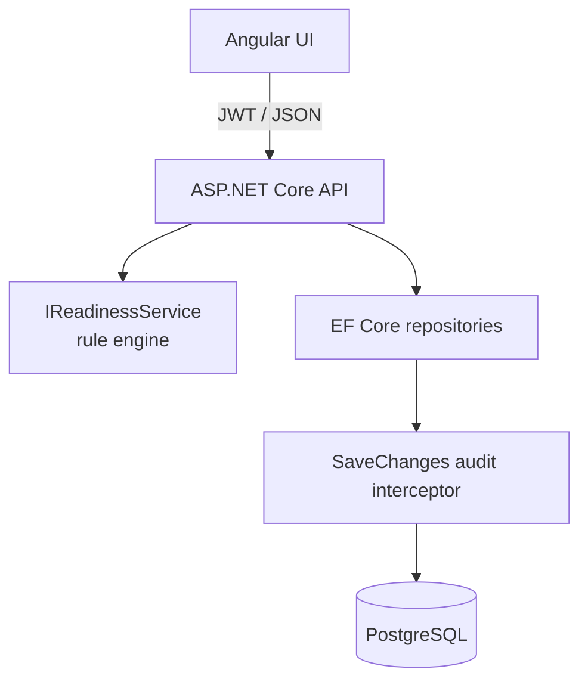

# TimeReady

**Leave and time-balance assistant for HR teams.**

Before vacation starts, someone still has to check the boring parts: time balance, remaining days, manager informed, handover done. TimeReady keeps those facts in one place and says whether a person is actually **ready** to leave — or what is still missing.

[](https://github.com/mahbejam/TimeReady/actions/workflows/ci.yml)
[](https://dotnet.microsoft.com/)
[](https://angular.dev/)
[](https://www.postgresql.org/)
[](LICENSE)

**Author:** [mahbejam](https://github.com/mahbejam)

| | |
| --- | --- |
| **What it is** | Full-stack HR readiness check (Angular UI + ASP.NET Core API + PostgreSQL) |
| **Decision style** | Explicit business rules — readable, testable, explainable |
| **Why it exists** | Portfolio project demonstrating full-stack delivery, security basics, and clear scope |
| **Run it** | `docker compose up --build` → http://localhost:4200 |

## Table of contents

- [Features](#features)
- [Why this project](#why-this-project)
- [Status](#status)
- [Tech stack](#tech-stack)
- [Architecture](#architecture)
- [Repository layout](#repository-layout)
- [Getting started](#getting-started)
- [Demo accounts and data](#demo-accounts-and-data)
- [Documentation](#documentation)
- [Screenshots](#screenshots)
- [Roadmap](#roadmap)
- [License](#license)

## Features

| Area | Description |
| --- | --- |
| **Angular frontend** | Standalone Angular 20 app with Material UI — dashboard, employees, notifications, and audit views |
| **ASP.NET Core backend** | REST API on .NET 9 with Identity, JWT, FluentValidation, and Serilog |
| **PostgreSQL database** | EF Core 9 with Npgsql; migrations and seed data applied on startup |
| **Docker Compose** | One-command local stack: database, API, and web frontend |
| **Authentication & authorization** | Login, JWT access tokens, refresh-token rotation, role-based policies (Admin / Operator) |
| **Employee readiness calculation** | Rule-based `IReadinessService` evaluates time balance, vacation timing, manager notice, and handover status |
| **Notifications** | UI surface for readiness warnings and follow-up items |
| **Audit logging** | Append-only change history with retention and archive support (Admin only) |
| **Health checks** | API: `/health`, `/health/live`, `/health/ready`; frontend: `/healthz` |
| **Tests** | Backend: xUnit unit + integration tests; frontend: Vitest unit tests |

### Verified test results

| Suite | Result |
| --- | --- |
| Frontend (`npm test`) | **38 / 38 passed** |
| Backend (`dotnet test`) | **39 / 39 passed** |

### Local URLs

| Service | URL |
| --- | --- |
| Frontend | http://localhost:4200 |
| API | http://localhost:5080 |
| API Swagger | http://localhost:5080/swagger |
| API health | http://localhost:5080/health |
| Web health check | http://localhost:4200/healthz |

## Why this project

Hiring managers rarely have time to reverse-engineer a repo. TimeReady is built so a reviewer can:

1. Understand the **business problem** in under a minute (this page).
2. See **honest scope** — what is in, what is deliberately out ([docs/product.md](docs/product.md)).
3. Follow **why** the design looks this way ([docs/decisions.md](docs/decisions.md)).
4. Run the stack and sign in as Admin or Operator without a setup novel.

The readiness engine is a **rule-based decision engine**. It applies readable thresholds and flags behind `IReadinessService` — no black-box scoring.

## Status

| Area | State |
| --- | --- |
| Backend API, rules, validation, persistence | Complete |
| Unit and integration tests | Complete |
| CI, Docker, seed data | Complete |
| Angular UI (dashboard, employees, notifications, audit) | Complete |
| Authentication (login, refresh, guards, role-aware UI) | Complete |

## Tech stack

| Layer | Choice |
| --- | --- |
| Frontend | Angular 20 (standalone), TypeScript, Angular Material |
| Backend | ASP.NET Core 9, Identity, JWT, FluentValidation, Serilog |
| Data | PostgreSQL 17, EF Core 9 (Npgsql) |
| Docs / API | Swagger / OpenAPI (Development) |
| Tests | xUnit + `WebApplicationFactory`; Vitest on the frontend |
| CI | GitHub Actions — backend test, frontend test and build |

## Architecture



Two deliberate constraints:

- The rule engine knows nothing about HTTP or the database — it takes an `Employee` and returns a `ReadinessResult`.
- The rule engine does not read the system clock — it receives a `TimeProvider`, so date rules stay reproducible in tests.

More detail: [docs/architecture.md](docs/architecture.md).

## Repository layout

```
TimeReady/
├── .github/workflows/ci.yml
├── backend/
│   ├── TimeReady.Api/          # Web API
│   └── TimeReady.Tests/        # Unit + integration tests
├── frontend/                   # Angular application
├── docs/                       # Product, architecture, security, API, testing
├── docker-compose.yml          # Production-shaped stack
├── docker-compose.override.yml # Local development conveniences
├── CONTRIBUTING.md
├── SECURITY.md
└── README.md
```

## Getting started

### Full stack with Docker Compose (recommended)

Prerequisites: [Docker Desktop](https://www.docker.com/products/docker-desktop/) (or Docker Engine + Compose).

```bash
git clone https://github.com/mahbejam/TimeReady.git
cd TimeReady
docker compose up --build
```

| What | Where |
| --- | --- |
| Application | http://localhost:4200 |
| Swagger UI | http://localhost:5080/swagger |
| API health | http://localhost:5080/health |
| Web health check | http://localhost:4200/healthz |
| PostgreSQL | localhost:5432 (`timeready` / `timeready` — demo credentials) |

Compose starts Postgres, applies migrations, seeds demo data and accounts, then serves the UI once the API is healthy.

```bash
docker compose down       # stop
docker compose down -v    # stop and drop the database volume
```

### Production-shaped Compose

`docker compose up` merges the override file (published ports, Swagger, throwaway secrets). For the base file only:

```bash
cp .env.example .env      # fill JWT_SIGNING_KEY and passwords
docker compose -f docker-compose.yml up --build
```

Startup fails fast if the signing key is missing or shorter than 32 characters.

### Running parts directly

Prerequisites: .NET SDK 9.0, Node.js 20+, PostgreSQL.

```bash
docker compose up -d db

cd backend/TimeReady.Api && dotnet run    # http://localhost:5080
cd ../../frontend && npm ci && npm start  # http://localhost:4200
```

### Tests

```bash
docker compose up -d db
cd backend && dotnet test
cd ../frontend && npm test
```

See [docs/testing.md](docs/testing.md).

## Demo accounts and data

> **Demo credentials only.** These accounts exist for local evaluation. Change all passwords before any shared or internet-facing deployment.

| Account | Role | Password | What you see |
| --- | --- | --- | --- |
| `admin@timeready.local` | Admin | `Admin#Demo2026` | Full UI including audit, create and delete |
| `operator@timeready.local` | Operator | `Operator#Demo2026` | Overview, employees, notifications — no audit / add / delete |

Both accounts are listed on the login page.

Seed employees are chosen so every readiness rule fires at least once (positive and negative balances, imminent and distant vacations, incomplete handovers). Vacation dates are relative to “today”, so the demo stays meaningful whenever the repo is cloned.

| Employee | Balance | Days left | Vacation | Manager | Handover |
| --- | --- | --- | --- | --- | --- |
| Anna Gruber | +12.5 h | 18 | in 3 days | yes | no |
| Michael Hofer | -22.0 h | 6 | in 12 days | no | no |
| Sarah Lang | +3.25 h | 24 | not planned | no | no |
| Thomas Egger | -4.5 h | 11 | in 45 days | yes | yes |
| Lena Moser | +38.0 h | 2 | in 6 days | yes | yes |

## Documentation

| Document | Purpose |
| --- | --- |
| [docs/product.md](docs/product.md) | Problem, users, scope and non-goals |
| [docs/architecture.md](docs/architecture.md) | System and request flow |
| [docs/decisions.md](docs/decisions.md) | Design trade-offs |
| [docs/security.md](docs/security.md) | Auth, hardening, known limits |
| [docs/operations.md](docs/operations.md) | Health, logging, Compose caveats |
| [docs/api.md](docs/api.md) | Endpoints and rule codes |
| [docs/testing.md](docs/testing.md) | Suites and how to run them |
| [CONTRIBUTING.md](CONTRIBUTING.md) | Local setup and PR expectations |
| [SECURITY.md](SECURITY.md) | How to report vulnerabilities |

## Screenshots

Add captures under [`docs/screenshots/`](docs/screenshots/) after your first local run (see that folder’s README for suggested filenames).

| View | File |
| --- | --- |
| Dashboard | `docs/screenshots/dashboard.png` |
| Employee dialog | `docs/screenshots/employee-dialog.png` |
| Notifications | `docs/screenshots/notifications.png` |
| Audit (Admin) | `docs/screenshots/audit.png` |

## Roadmap

- Refresh token as an HttpOnly cookie instead of `sessionStorage`
- Retention status screen in the Angular app
- Natural-language summary of rule findings (rules remain the source of truth)
- Per-manager views (still no invented multi-tenant SaaS scope)

## License

MIT — see [LICENSE](LICENSE). Copyright (c) 2026 [mahbejam](https://github.com/mahbejam).
