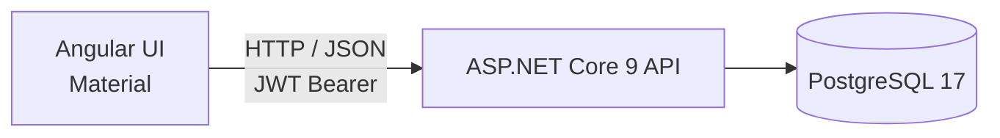
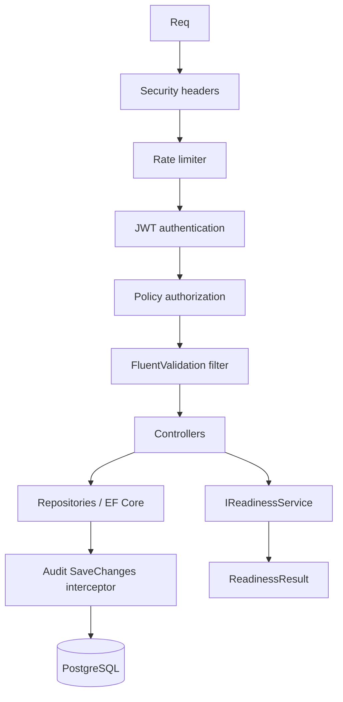
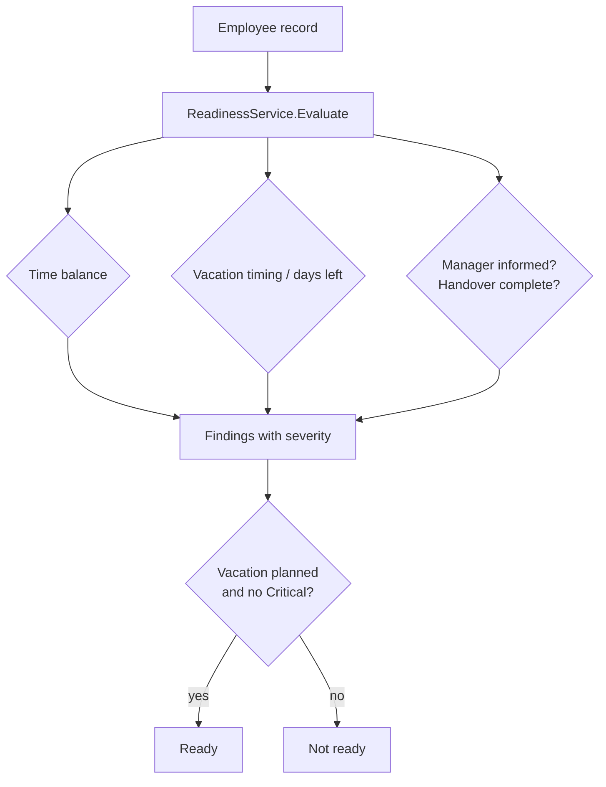
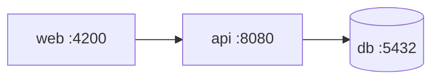

# Architecture

Purpose: describe how the pieces fit together so a technical reader can navigate the codebase quickly.

## High-level view

## Request pipeline

Controllers stay thin: they map DTOs, call services or repositories, and return results. Business rules for vacation readiness live in `IReadinessService`. Persistence and HTTP concerns stay outside that service.

## Backend layout

| Area | Responsibility |
| --- | --- |
| `Controllers/` | HTTP surface: auth, employees, readiness, audit |
| `Services/` | Readiness rules; auth/token services; audit retention |
| `Data/` | `AppDbContext`, repositories, EF configurations, seeding, audit interceptor |
| `Configuration/` | Strongly typed options validated at startup |
| `Infrastructure/` | Exception handler, security headers, health output, retention background job |
| `Validation/` | FluentValidation validators and the action filter |
| `Dtos/` / `Mapping/` | API contracts and entity ↔ DTO mapping |

## Frontend layout

| Area | Responsibility |
| --- | --- |
| `core/auth` | Login, token storage, interceptor, guards |
| `core/services` | HTTP clients for employees, readiness, audit |
| `core/state` | Shared HR store used by dashboard and lists |
| `features/*` | Screens: login, dashboard, employees, notifications, audit |
| `shared/*` | Small reusable UI pieces (status badge, score card, data-state) |

## Readiness evaluation

Thresholds come from the `Readiness` section in configuration (`CriticalNegativeBalanceHours`, `WarningNegativeBalanceHours`, `ImminentVacationDays`, `LowVacationDaysThreshold`). The service receives a `TimeProvider` instead of reading the system clock, so date-based rules stay deterministic in tests.

## Audit trail

Every create, update and delete of an `IAuditable` entity is recorded through an EF Core `SaveChangesInterceptor`. Controllers do not write audit rows themselves — anything that goes through `SaveChanges` is covered.

A background job archives live entries after the configured retention period and can optionally purge the archive. Purging defaults to off.

## Compose topology

In development, `docker-compose.override.yml` publishes the API on port 5080 and the database on 5432, enables Swagger, and injects throwaway secrets. The base `docker-compose.yml` is the production shape: no Swagger, secrets from the environment only.

## Related reading

- [Product](product.md) — why this system exists
- [Decisions](decisions.md) — trade-offs behind the design
- [Security](security.md) — auth and hardening details
